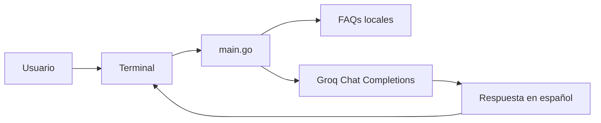

# Agente de FAQs de Parachute S.A.

Agente de preguntas frecuentes en Go para responder consultas sobre el evento de paracaidismo de Parachute S.A. usando un archivo local de FAQs como fuente de contexto y Groq Chat Completions como modelo de respuesta.

## Objetivos

- Explorar una arquitectura RAG simple sin infraestructura adicional.
- Usar un SDK compatible con la especificación de la API de OpenAI.

## Arquitectura

El flujo del proyecto es deliberadamente simple:

1. El archivo local de FAQs se carga desde el filesystem.
2. Su contenido se inyecta como contexto.
3. La pregunta del usuario y el contexto se envían a Groq.
4. El modelo genera una respuesta restringida a la información disponible en las FAQs.



## Qué no usa esta implementación

- Embeddings.
- Base de datos vectorial.
- Búsqueda semántica.
- Historial conversacional.

Cada pregunta se envía de forma independiente con el documento completo como contexto.

## Tecnologías y versiones

- Go `1.26.6` según `go.mod`.
- `github.com/openai/openai-go/v3` `v3.54.0`.
- `github.com/joho/godotenv` `v1.5.1`.
- Groq Chat Completions con base URL `https://api.groq.com/openai/v1`.

## Estructura del repositorio

```text
.
├── .env.example
├── .gitignore
├── README.md
├── data/
│   └── FAQs_Parachute_SA_Guatemala_2026.txt
├── go.mod
├── go.sum
├── main.go
└── main_test.go
```

## Requisitos previos

- Go `1.26.6` o una versión compatible.
- Una cuenta de Groq con acceso a un modelo disponible.
- `GROQ_API_KEY` configurada localmente.
- `GROQ_MODEL` configurada con un modelo disponible en tu cuenta.

## Instalación

```bash
git clone https://github.com/MarceloDetlefsen/hdt3-ai.git
cd hdt3-ai
go mod download
```

## Configuración

1. Copia el archivo de ejemplo:

```bash
cp .env.example .env
```

2. Edita `.env` y configura tus variables:

```env
GROQ_API_KEY=tu_api_key_local
GROQ_MODEL=un_modelo_disponible_en_tu_cuenta
```

## Variables de entorno sin `.env`

### Linux o macOS

```bash
export GROQ_API_KEY="tu_api_key_local"
export GROQ_MODEL="un_modelo_disponible_en_tu_cuenta"
go run .
```

### PowerShell

```powershell
$env:GROQ_API_KEY = "tu_api_key_local"
$env:GROQ_MODEL = "un_modelo_disponible_en_tu_cuenta"
go run .
```

## Ejecución

```bash
go run .
```

Al iniciar, el agente carga la configuración, lee las FAQs y abre un ciclo interactivo en la terminal.

## Uso

Ejemplo de sesión:

```text
Agente de FAQs de Parachute S.A.
Responde preguntas sobre el evento. Escribe Bye o presiona Ctrl-C para salir.
Tú: ¿Cuándo y dónde se llevará a cabo el evento?
Agente: ...
Tú: Bye
Agente: Hasta luego.
```

Puedes salir de dos formas:

- Escribiendo `Bye` en cualquier combinación de mayúsculas y minúsculas.
- Presionando `Ctrl-C`.

## Ejemplos de preguntas

- Fecha y lugar: `¿Cuándo y dónde se llevará a cabo el evento?`
- Límite de peso: `¿Cuál es el límite de peso para realizar el salto?`
- Cámaras: `¿Puedo llevar mi propia cámara o Go-Pro durante el salto?`
- Fuera de las FAQs: `¿Qué costo tiene el estacionamiento VIP?`

Cuando una pregunta no está respaldada por las FAQs, el agente responde:

```text
No puedo responder esa pregunta con la información disponible en las FAQs.
```

## Pruebas y validación

```bash
go test ./...
go vet ./...
go build ./...
```

## Limitaciones conocidas

- No usa embeddings ni búsqueda semántica.
- No tiene historial conversacional.
- No consulta otras fuentes fuera del archivo local de FAQs.
- La calidad de la respuesta depende de que la información esté presente en el documento.
- No incluye streaming ni herramientas externas.

## Video de demostración

...

## Autor

Marcelo Detlefsen - 24554

